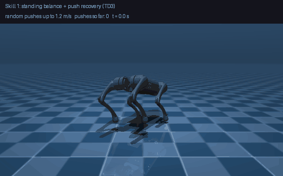
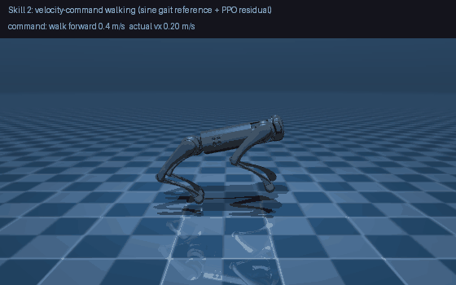
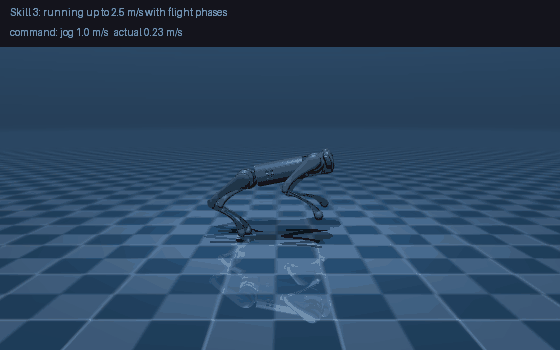
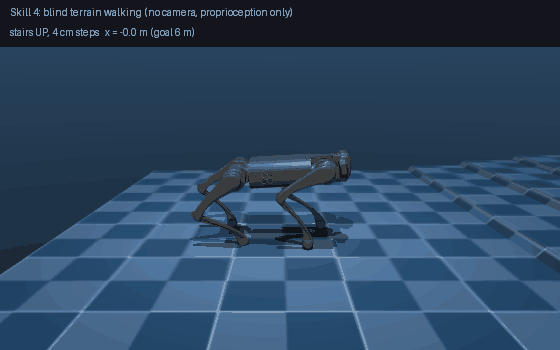
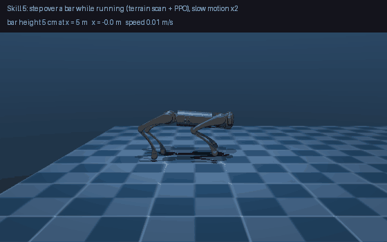

# RaceVLA

[](https://github.com/haidar996/racevla/actions/workflows/tests.yml)   

**Learning a locomotion skill library for the Unitree Go1 quadruped in MuJoCo, as the foundation for vision-language guided skill switching.**

Five reinforcement-learning skills, trained with PPO / TD3 on a single laptop CPU (4 cores, no GPU), all on the same simulated Go1:

| | | |
|:--:|:--:|:--:|
|  |  |  |
| **1. Stand + push recovery** | **2. Walk (velocity commands)** | **3. Run up to 2.5 m/s, with flight** |
|  |  | |
| **4. Blind terrain walking** | **5. Step over a bar while running** | |

The long-term goal (see [Roadmap](#roadmap)) is a robot that is told in language what to do ("run to the bar, step over it, stop") and a vision-language model that picks the right skill. This repository contains the skills, the environments, the trained policies and every number behind them, including what did **not** work.

## Results at a glance

All numbers are simulation, deterministic policies, on fresh random episodes (standing: 200 seeds never used for checkpoint selection; walking 50, running 50, terrain 20 per cell, step-over 20 per bar height). The model cards in [`models/`](models) have the full tables.

| Skill | Policy | Result | Scope / honest limits |
|---|---|---|---|
| **Stand + push recovery** | TD3, 1M steps, [`standing_policy_td3_seed0.zip`](models/standing_policy_td3_seed0.zip) | **0 / 200 falls** (20 s episodes, pushes 0.4-1.2 m/s every 1-3 s; doing nothing falls 61 %) | needs a 0.2 s passive warm-up; never trained to get up after a fall |
| **Walking** | PPO, 1M steps, sine gait reference + learned residual, [`walking_policy_sine_seed1.zip`](models/walking_policy_sine_seed1.zip) | 0 / 50 falls, speed error 0.03 m/s, 96 % of commanded speed reached, turning 0.36 of 0.40 rad/s asked | 0-0.6 m/s, flat ground, no pushes |
| **Running** | PPO, 3-stage speed curriculum 1.5 → 2.0 → 2.5 m/s, [`running_policy_2p5_seed0.zip`](models/running_policy_2p5_seed0.zip) | 1 / 50 falls, 94 % of commanded speed, **28 % of the time all four feet are off the ground** (commands ≥ 1 m/s) | flat ground, no pushes; the 2.5 m/s gait table row is extrapolated |
| **Blind terrain walking** | PPO, 2M steps on a mixed curriculum, [`terrain_policy_seed2.zip`](models/terrain_policy_seed2.zip) | 99 % mean success in scope: rough ground ≤ 10 cm, slopes ±15°, stairs up ≤ 4 cm, stairs down ≤ 6 cm (the plain walking policy: 80 % at 0.4 m/s, 94 % at 0.6 m/s) | proprioception only: it cannot see steps, so tall stairs up (≥ 8 cm) are not solved; no pushes |
| **Step over a bar while running** | PPO with a far height scan, [`hurdle_stepover_seed0.zip`](models/hurdle_stepover_seed0.zip) | at 1.3-1.7 m/s: 3 cm 100 %, 5 cm 90 %, **7 cm 80 %**, 10 cm 35 %, ≥ 15 cm ~0 % (20 episodes each) | reliable to about 7 cm; the original 10-25 cm target was **not** reached (see below); the checkpoint was picked on the same 20-episode evaluation, so these numbers are slightly optimistic |

## Skill interfaces

Each skill is a separate policy with its own command input. This is what a supervisor (the next step of the project) has to provide:

| Skill | Command it takes | Observation | Action | Notes |
|---|---|---|---|---|
| Stand + push recovery | none | 45 | 12 joint offsets | 0.2 s passive warm-up first |
| Walking | forward speed 0-0.6 m/s, yaw rate ±0.5 rad/s | 49 (45 + command + 2 gait-clock values) | 12 | stands still when told 0 |
| Running | forward speed 0-2.5 m/s, yaw rate ±0.5 rad/s | 49 | 12 | needs `models/running_gait_table.json` |
| Blind terrain walking | forward 0.4-0.8 m/s + heading hold | 49 | 12 | 20 % flat, rest rough / slopes / stairs in training |
| Step over a bar | forward 1.3-1.7 m/s + far height scan | 75 (49 + 24 scan + 2 unused) | 12 | the scan comes from the simulator height map |

Observations are normalised with `FixedObsNormalize`; a raw observation makes any policy meaningless.

## How it works

- **Robot and simulator.** Unitree Go1 (the MuJoCo model from [MuJoCo Menagerie](https://github.com/google-deepmind/mujoco_menagerie), Unitree's BSD-3 license; `scene_terrain.xml` is added here), 12 actuated joints, 500 Hz physics, 50 Hz policy, PD joint control (Kp 100, Kd 0.5) with the real torque limits.
- **Actions and observations.** The policy outputs joint-angle offsets; the 45-number robot observation (joint positions/velocities, gravity vector, body velocities, last action) is scaled by *fixed* physical limits ([`FixedObsNormalize`](racevla/envs/wrappers.py)) instead of running statistics, so policies from different seeds see identical inputs.
- **Reference + residual for gaits.** Pure reward shaping never produced a clean trot (option C in [`docs/walking_options_comparison.md`](docs/walking_options_comparison.md): 0 of 3 seeds learned it). What worked: a gait clock drives a sine-shaped foot trajectory (exact two-link leg inverse kinematics), and the network learns a small correction on top. It learned to walk in about 200-250k steps instead of never.
- **Running = the same idea, with a speed-dependent gait table** (step rate 2.5 → 4 Hz, longer swing, 4 cm stance push-off) and a speed curriculum warm-started from the walking policy. The flight phase appears as a by-product, it is not rewarded as a goal.
- **Terrain.** A MuJoCo height field generator (rough ground, slopes, stairs up/down, hurdles) and a per-terrain-type curriculum: each difficulty level unlocks at ≥ 80 % success. All terrain types are mixed within one training run.
- **Seeing a bar.** The step-over skill gets a coarse far scan of the ground height (8 rows, 0.2-1.6 m ahead, max-pooled so a thin bar is never skipped) and a reference gait that lifts each swing foot to the highest ground within 0.32 m ahead.

## What did not work (kept in the repo on purpose)

- **PPO on standing recovery** had large seed-to-seed variance (0-27 % falls at the best checkpoint across 9 runs); the full log with every hyperparameter is in [`docs/ppo_experiments_log.md`](docs/ppo_experiments_log.md). TD3 and SAC were compared next; SAC (one seed completed) reached the best score fastest but oscillated strongly late in training.
- **Jumping over 10-25 cm hurdles while running.** A scripted jump clears the *height* (24-43 cm) but flies only 0.05-0.5 m forward, and the 0.65 m long robot needs about 0.8-1 m of flight to pass over a bar. A learned trigger for it stalled at 3 cm. I replaced it with the step-over skill above (reliable to 7 cm). A standing-start RL jump following the literature recipe (projectile-densified reward, reference state initialisation, staged curriculum) took off to the right height but never landed upright, so I dropped it for now.
- **A height-scan-aware gait for tall stairs** gave limited gain and was stopped.

The published Go1 results use 4096 parallel GPU environments; this project trains on 4 CPU environments, which is the main reason the jump targets were out of reach.

## Quick start

```bash
git clone https://github.com/haidar996/racevla.git && cd racevla
python -m venv .venv && source .venv/bin/activate
pip install -r requirements.txt

# watch a skill in the MuJoCo viewer
python scripts/phase4_walking/03_view_walk.py models/walking_policy_sine_seed1.zip --sine
python scripts/phase5_running/06_view_running.py models/running_policy_2p5_seed0.zip
python scripts/phase6_terrain/06_view_stairs_tour.py --terrains others
python scripts/phase7_skills/18_view_stepover.py

# (viewers need a display; the GIF script renders headless with EGL)
# regenerate the GIFs above
python scripts/make_demos.py
```

Train a skill (each phase folder has the exact scripts used; 4 envs, no GPU needed):

```bash
python scripts/phase4_walking/02_train_walk_ppo.py --env sine --run-name walk_sine_seed1 --seed 1 --steps 1000000
bash scripts/phase5_running/run_pipeline.sh            # 3-stage running curriculum
python scripts/phase6_terrain/05_train_terrain_ppo.py --help   # see 'models/terrain_policy_final.md' for the exact command
```

## Tests

```bash
pip install -e ".[dev]" && pytest -q     # 11 smoke tests, ~10 s: environments, terrain generator, every released policy loads and behaves
```

The same tests run in GitHub Actions on every push.

## Repository layout

```
racevla/envs/             Gymnasium environments: standing, walking (clock / sine / reward-only), running, terrain, scan, hurdle, step-over
racevla/envs/terrain.py   height-field terrain generator (rough, slopes, stairs, hurdles)
racevla/envs/wrappers.py  FixedObsNormalize
racevla/controllers/      PD joint controller
assets/robots/unitree_go1 MuJoCo model + terrain scene
scripts/                  per-phase tests, training, evaluation and viewer scripts (see scripts/README.md)
models/                   released policies + a model card (.md) for each: config, how to run, results, known limits
experiments/              catalogue of all experiments + raw learning curves (runs/) and console logs (logs/)
docs/                     experiment logs, option comparisons, figures, demo media
outputs/analysis/         evaluation tables and figures behind the numbers above
tests/                    smoke tests (pytest)
```

## Further reading

- [`experiments/`](experiments): **every experiment in order, including failures**, with learning curves and logs for all 53 run folders
- Model cards (exact configs, commands, full result tables): [`models/*_final.md`](models)
- [`docs/ppo_experiments_log.md`](docs/ppo_experiments_log.md): all nine PPO runs on standing recovery
- [`docs/walking_options_comparison.md`](docs/walking_options_comparison.md), [`docs/running_options_comparison.md`](docs/running_options_comparison.md): the design alternatives that were compared, over three seeds each
- Figures: [`docs/figures/`](docs/figures) and [`outputs/analysis/`](outputs/analysis)

## Roadmap

- [x] Phase 1-3: simulator, environments, standing and push recovery (PPO vs SAC vs TD3)
- [x] Phase 4: walking · Phase 5: running with flight · Phase 6: terrain · Phase 7: hurdle step-over
- [ ] **Skill switching**: a supervisor that hands over between stand / walk / run / terrain / step-over
- [ ] Vision: an onboard camera instead of the simulator height scan
- [ ] **VLA**: a vision-language model that selects skills and commands from an instruction, evaluated on a race course

## Limitations

Simulation only, one robot, no domain randomization (friction, mass, motor strength), single seed for the step-over skill, and each skill was trained and tested in its own scope. Transitions between skills are the next thing to be tested, not yet a result.

## Acknowledgements

[MuJoCo](https://github.com/google-deepmind/mujoco) and [MuJoCo Menagerie](https://github.com/google-deepmind/mujoco_menagerie) (Go1 model), [Stable-Baselines3](https://github.com/DLR-RM/stable-baselines3) (PPO, SAC, TD3), [Gymnasium](https://gymnasium.farama.org/). All training was done on a laptop CPU (i7-6600U, 4 cores).

## License

MIT for the code (see [LICENSE](LICENSE)); the Go1 model keeps its own BSD-3-Clause license (see `assets/robots/unitree_go1/LICENSE`).
