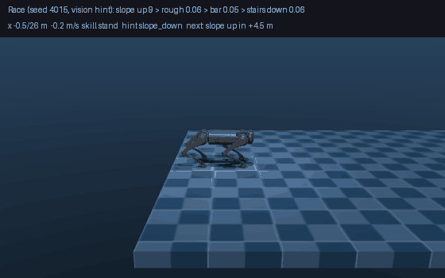

# Race course (Phase 8)

Written 2026-10-09. Code: [`racevla/envs/race.py`](../racevla/envs/race.py), [`racevla/skills/hint_filter.py`](../racevla/skills/hint_filter.py) · scripts: [`scripts/phase8_race/`](../scripts/phase8_race) · results: [`outputs/analysis/race/`](../outputs/analysis/race).



*Seed 4015 with the vision hint (depth camera → elevation map, CNN → terrain hint): slope up 9°, rough 6 cm, a 5 cm bar, stairs down 6 cm, finished in 27.1 s. It is a success case, not a typical one. The caption shows the classifier's hint: it says "rough" while the step-over skill is active.*

The single-patch trials of [`skill_switching.md`](skill_switching.md) and [`vision.md`](vision.md) never tested hand-overs right after a patch, a new section arriving while the robot is still recovering, or errors piling up. The race does: one long track of several sections in a row, driven by the rule supervisor.

## The course

[`build_course(seed)`](../racevla/envs/race.py) draws 4 sections at random from rough, slope up, slope down, stairs up, stairs down and a bar (never two bars in a row), with levels inside what the skills can do (rough 4 / 6 cm, slopes 9° / 15°, stairs up 3 / 4 cm, stairs down 4 / 6 cm, bar 3 / 5 cm). A flat lead-in of 4 m comes first, a flat gap of 3 m follows every section, and each section starts at the ground height the previous one ended at (so stairs up followed by stairs down stays consistent; a down section is only drawn when there is height to descend). The ground never goes above 1.25 m. [`courses.png`](../outputs/analysis/race/courses.png) shows six of them. The height field is 46 m x 3 m on the same 4 cm grid ([`scene_race.xml`](../assets/robots/unitree_go1/scene_race.xml)); courses are 20-30 m long.

Each race: seed 4000 + i draws the course and a target speed U(1.3, 1.7) m/s; the robot starts standing at x = -0.5 m. A race **ends** when the robot crosses the finish line (success), falls, leaves the course sideways, makes less than 0.25 m of new progress in 10 s (stuck), or after 120 s. Recorded per race: success, time, sections passed, where and in which skill it ended, steps per skill, switches, and how often the vision hint agrees with the oracle.

## Results (40 courses, seeds 4000-4039, 4 sections each)

| Hint | Finished | Mean time of finishers | Sections passed (of 4) | Fell / left course / stuck |
|---|---|---|---|---|
| **Oracle** (hint read from the course layout) | **92 %** (37 / 40) | 28.5 s | 3.77 | 1 / 0 / 2 |
| **Vision**, hint as the classifier gives it | **58 %** (23 / 40) | 31.7 s | 2.90 | 8 / 6 / 3 |
| Vision, hint smoothed (a new group must be asked for 10 steps in a row) | 62 % (25 / 40) | 31.6 s | 2.88 | 11 / 3 / 1 |
| Vision, smoothed over 25 steps | 58 % (23 / 40) | 29.8 s | 3.05 | 6 / 8 / 3 |

Files: [`summary_oracle.md`](../outputs/analysis/race/summary_oracle.md), [`summary_vision.md`](../outputs/analysis/race/summary_vision.md), [`summary_vision_hold10.md`](../outputs/analysis/race/summary_vision_hold10.md), [`summary_vision_hold25.md`](../outputs/analysis/race/summary_vision_hold25.md) (per-race rows in the matching `races_*.csv`).

- **With a correct hint the supervisor and the skills work**: 37 of 40 courses finished with all hand-overs. The three oracle failures: two stuck at stairs up, one at the bar.
- **With the classifier's hint only 58 % finish.** The unfinished vision races ended mostly on slope up (8), rough ground (4) and stairs up (3).
- **The oracle runs were added by me on top of the requested vision runs**, because without them a failure could not be put down to vision or to the course.
- 40 courses is a modest sample; 58 % and 62 % are not different.

## What went wrong, step by step

1. **First guess: the hint flickers.** The switch logs of failed races show run → terrain → run every 25-30 steps (the minimum dwell time). [`HintFilter`](../racevla/skills/hint_filter.py) makes the supervisor see a new hint group only after the classifier has asked for it on 10 or 25 steps in a row (the bar enters at once, because the patch trials showed that delaying it costs successes). Result above: **no gain** (58 / 62 / 58 %), and the agreement with the oracle fell from 52 % to 44 %. Flicker was not the main cause.
2. **Diagnosis: log everything.** [`02_diagnose_hints.py`](../scripts/phase8_race/02_diagnose_hints.py) on the 40 vision races (the logged run reproduces the earlier one exactly: 58 %, 52 % agreement; [`diagnose_diag.md`](../outputs/analysis/race/diagnose_diag.md), [confusion figure](../outputs/analysis/race/diagnose_confusion_diag.png)): over all race steps the classifier is right on **35 %** with 7 classes and **52 %** with 3 groups, against 73 % / 81 % on held-out single-patch frames. On steps whose truth is flat it says "flat" only **12 %** of the time (slope down 29 %, rough 22 %, stairs down 18 %, bar 10 %). Even with the next section 6 m or more ahead (only flat floor in view) it is right 7 % of the time.
3. **Root cause: sideways drift.** [`04_flat_drive_probe.py`](../scripts/phase8_race/04_flat_drive_probe.py) drives the real supervisor on a perfectly flat floor and logs the classifier's answers. They get worse with the distance run (88 % "flat" at x = 7-11 m, 4 % at x = 39 m), and the cause is the robot's sideways position y:

| \|y\| (m) | 0.0-0.2 | 0.2-0.4 | 0.4-0.6 | 0.6-0.8 | 0.8-1.0 | 1.0-1.4 |
|---|---|---|---|---|---|---|
| says "flat" | 82 % | 61 % | 39 % | 8 % | 0 % | 2 % |
| says instead | rough 7 %, stairs down 7 % | rough 22 % | rough 29 %, stairs down 26 % | stairs down 61 % | rough 73 % | rough 97 % |

The height field is 3 m wide with nothing beyond ±1.5 m. The run policy drifts sideways as it runs (the heading hold keeps it pointing straight but does not centre it), and away from the centre the camera sees the side edge of the field as a drop that looks like stairs down. Training episodes were short and the robot stayed near y = 0, so the classifier never saw this. The same drift is the likely reason for the 6 of 40 "left course" endings. On the 10 m training course the same probe gives 80-100 % "flat" from x = 1 m on.

An earlier probe with the robot standing perfectly level ([`03_flat_probe.py`](../scripts/phase8_race/03_flat_probe.py)) was **not informative**: a perfectly level standing pose is not what the classifier was trained on, so it said "stairs down" almost everywhere. It is kept only as a record.

## What this means, and what was not done

The race is a **negative result for the current vision part**: the single-patch numbers (73-74 % with vision against 84 % with the oracle) do not carry over to a long course (58 % against 92 %). Not tried, in the order I would try them:
1. **Keep the robot near the centre** (add a small sideways correction to the heading hold: desired heading turns back toward y = 0). Cheap, keeps the camera in the conditions the classifier knows, and should reduce the "left course" endings. It does not make the classifier itself robust.
2. **Retrain the classifier with random sideways and heading offsets**, so it learns to ignore the side edge (a data collection and a training run, 1-2 hours).
3. A wider height field or a skirt around it (the camera would no longer see a void), which also needs retraining because the training world changes.

## Reproduce and watch

```bash
export MUJOCO_GL=egl
python scripts/phase8_race/00_show_courses.py                                   # side views of random courses
python scripts/phase8_race/01_run_races.py --races 40 --hint oracle --tag _oracle
python scripts/phase8_race/01_run_races.py --races 40 --hint vision --tag _vision
python scripts/phase8_race/01_run_races.py --races 40 --hint vision --hold 10 --tag _vision_hold10
python scripts/phase8_race/01_run_races.py --races 40 --hint vision --tag _diag   # also writes diag_diag.json
python scripts/phase8_race/02_diagnose_hints.py --tag _diag
python scripts/phase8_race/04_flat_drive_probe.py --part C                       # classifier answers by sideways position
python scripts/phase8_race/05_view_race.py --seed 4015                           # MuJoCo window (needs a display); --hint oracle, --slow 2
python scripts/phase8_race/06_record_race.py --seed 4015                         # writes docs/media/race.gif
```

Each 40-race run takes about 5 minutes on 4 cores. Vision seeds that finished and have different sections: 4001, 4009, 4012, 4015, 4023.
